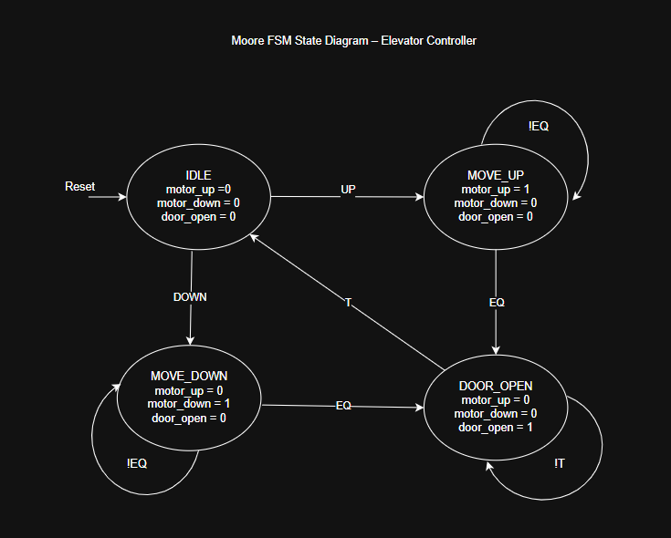
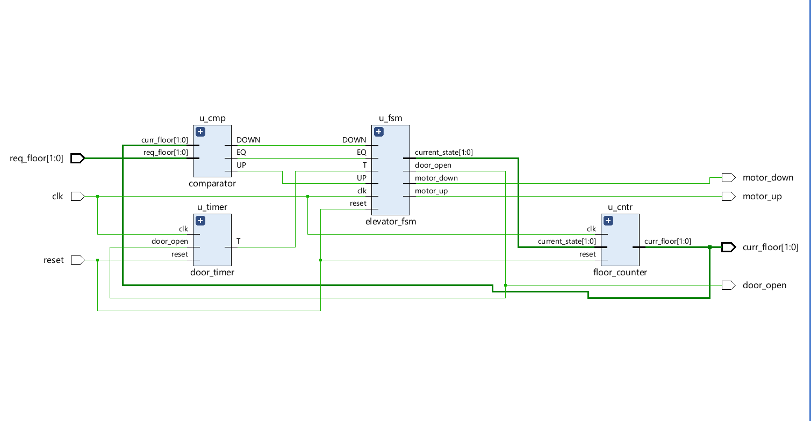
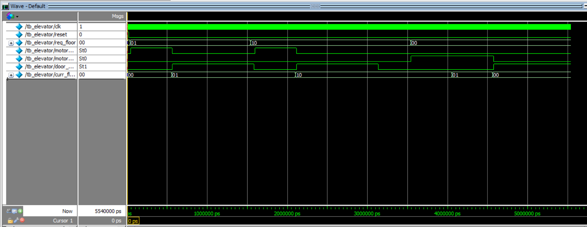
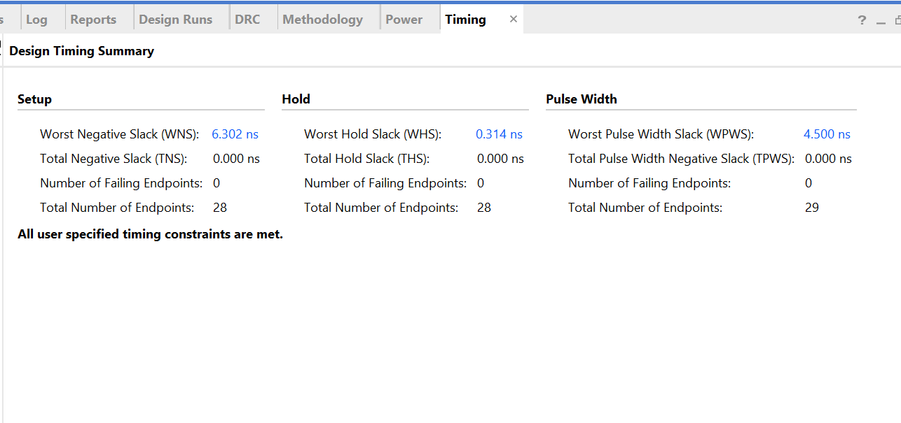
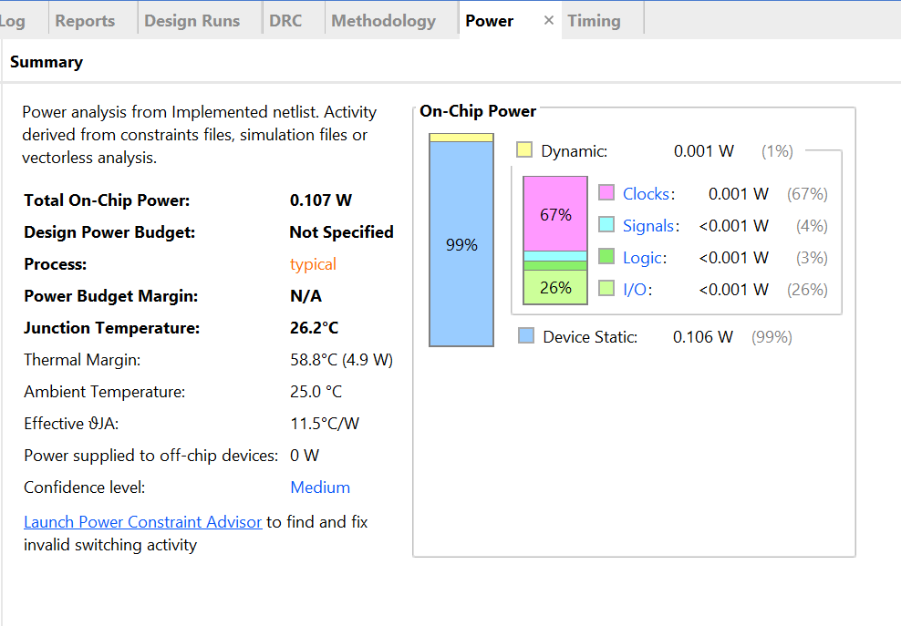
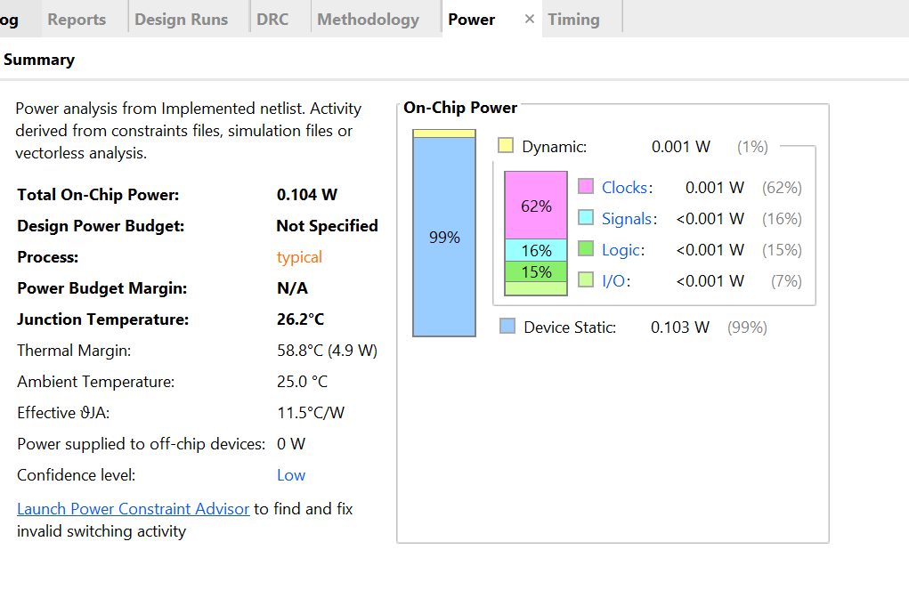

# fsm-elevator-controller-fpga
RTL-based Moore FSM Elevator Controller in Verilog HDL with clock-enable optimization, timing analysis, power evaluation, and FPGA validation on ZedBoard (Zynq-7000).
---

## 📌 Project Overview

This project implements a 4-state Moore FSM-based Elevator Controller using modular RTL design methodology.

Two design versions were developed:

1. Baseline Version (standard synchronous FSM)
2. Clock-Enable Optimized Version (reduced switching activity)

Both versions were synthesized, implemented, timing-analyzed, power-evaluated, and validated on FPGA hardware.

---
## 🔁 FSM State Diagram

The elevator controller is implemented as a 4-state Moore finite state machine.

### States
- IDLE
- MOVE_UP
- MOVE_DOWN
- DOOR_OPEN

### Inputs
- `UP`   → Requested floor > current floor
- `DOWN` → Requested floor < current floor
- `EQ`   → Requested floor == current floor
- `T`    → Door timer completion signal
- `clk`, `reset`

### Outputs
- `motor_up`
- `motor_down`
- `door_open`

### Input → State → Output Flow

1. Floor comparison logic generates `UP`, `DOWN`, or `EQ`.
2. Based on these signals, the FSM transitions between states.
3. Outputs depend only on the current state (Moore architecture).
4. When `EQ` is asserted, the FSM enters `DOOR_OPEN`.
5. After timeout (`T`), the system returns to `IDLE`.

The Moore architecture ensures stable and glitch-free motor and door control signals.
Reset initializes the system to the `IDLE` state.

## 🏗️ Architecture

The design is divided into modular components:

- Comparator (floor comparison logic)
- Elevator FSM (Moore control logic)
- Floor Counter (movement tracking)
- Door Timer (timeout generation)
- Top Module (system integration)

Control and datapath logic are clearly separated.

---

## 🔄 Design Versions

### 1️⃣ Baseline Version
- Standard Moore FSM implementation
- State updates occur every clock cycle
- No clock-enable gating
- Fully validated on FPGA

### 2️⃣ Clock-Enable Optimized Version
- Introduced `fsm_en` signal for gated state updates
- Added movement enable control in floor counter
- Reduced unnecessary switching activity
- Minor reduction observed in clock dynamic power

---
## Post-Synthesis View

The following snapshot shows the synthesized RTL hierarchy after implementation in Vivado.

---

## 🧪 Verification

A common Verilog testbench (`tb/tb_elevator.v`) was developed and used to verify both versions.

Verification covered:

- FSM state transitions
- Floor increment/decrement logic
- Door timeout behavior
- Reset operation
- Direction control based on floor comparison

Both versions share identical top-level interfaces.

---
## 📊 Simulation Results

The following waveform shows complete functional verification of the elevator controller, including reset behavior, upward movement, downward movement, floor updates, and door operation.

---

## ⏱️ Timing Analysis

Clock Constraint: 100 MHz (10 ns period)

### Baseline Version
- Worst Negative Slack (WNS): 7.133 ns
- Total Negative Slack (TNS): 0
- Worst Hold Slack (WHS): 0.225 ns

### Clock-Enable Version
- Worst Negative Slack (WNS): 6.302 ns
- Total Negative Slack (TNS): 0.000 ns
- Worst Hold Slack (WHS): 0.314 ns

All timing constraints met.

---

## ⚡ Power Analysis

### Baseline Version
- Total On-Chip Power: 0.107 W
- Dynamic Power: 0.001 W
- Clock Contribution: 67% of dynamic power
- Device Static: 0.106 W

### Clock-Enable Version
- Total On-Chip Power: 0.104 W
- Dynamic Power: 0.001 W
- Clock Contribution: 62% of dynamic power
- Device Static: 0.103 W

Note: Total power reduction is minimal due to FPGA static power dominance.
## Power Comparison

| Version | Total Power | Clock Contribution | WNS |
|----------|------------|-------------------|------|
| Baseline | 0.107 W | 67% | 7.133 ns |
| Clock-Enable | 0.104 W | 62% | 6.302 ns |

Clock-enable optimization reduced clock dynamic switching while maintaining timing closure.

---

## 🖥️ FPGA Implementation

Target Board: ZedBoard (Zynq-7000, XC7Z020)

- 100 MHz onboard clock
- Switch-based floor request input
- LED indicators for motor and door status
- Successful bitstream generation and hardware validation

  ## 📌 Pin Configuration Table

| Component         | Pin (XDC) | Signal Name       | Description                                      |
|------------------|----------|-------------------|--------------------------------------------------|
| Switch SW0       | F22      | req_floor[0]      | Floor Request Input (Bit 0) — ON in photo       |
| Switch SW1       | G22      | req_floor[1]      | Floor Request Input (Bit 1) — OFF in photo      |
| LED LD0          | T22      | motor_up          | Status: Motor Moving Up                         |
| LED LD1          | T21      | motor_down        | Status: Motor Moving Down                       |
| LED LD2          | U22      | door_open         | Status: Elevator Door Open                      |
| LED LD6          | U14      | curr_floor[0]     | Current Floor Binary Display (LSB)              |
| LED LD7          | U19      | curr_floor[1]     | Current Floor Binary Display (MSB)              |
| BTNC (Center)    | P16      | reset             | System Hardware Reset                           |
| Oscillator       | Y9       | clk               | 100MHz Onboard System Clock                     |

  
  

---

## 📂 Repository Structure
fsm-elevator-controller-fpga/

├── rtl/ → Source RTL modules

├── tb/ → Testbench

├── constraints/ → XDC file

├── reports/ → Timing & Power reports

├── docs/ → Diagrams & Waveforms

└── README.md
---
### Quick Access
- [RTL - Baseline](rtl/baseline/)
- [RTL - Clock Enable](rtl/clock_enable/)
- [Testbench](tb/)
- [Reports](reports/)
- [Documentation](docs/)
---

## 🎯 Key Engineering Takeaways

- Practical implementation of a Moore FSM in FPGA
- Clean separation of control and datapath logic
- Understanding of setup and hold timing constraints
- Interpretation of WNS, TNS, and slack margins
- Analysis of FPGA static vs dynamic power behavior
- Clock-enable optimization and its impact on switching activity
- Modular RTL design and verification methodology

---

## 🚀 Future Improvements

- Multi-floor request queue implementation
- Priority scheduling logic
- ASIC-style clock gating exploration
- SAIF-based accurate power estimation
- Migration to ASIC flow for comparison study
---

